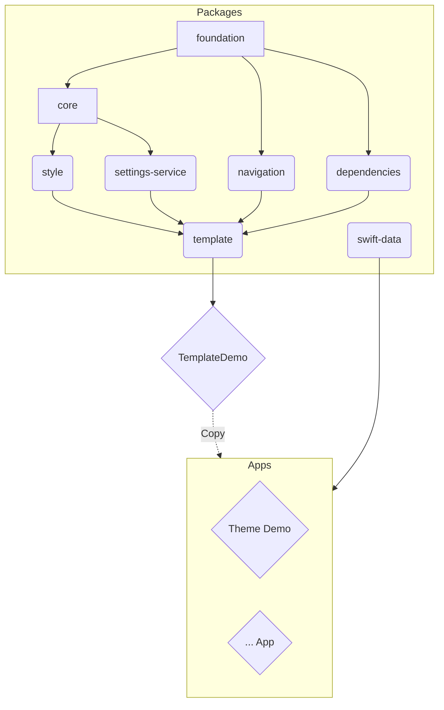

# SNAP - SN App Packages

Welcome to SNAP, a set of packages I use to build iOS Apps. They contain shared code, generic implementations of common features, and a template to kickstart a new project.

Disclaimer: Most packages are focussed on my own needs. They are public for you to get inspired, learn and tell me what I am doing wrong (srsly, pls tell me!).

## Highlights

SNAP contains a few packages in varying sizes and complexities. Some depend on each other, while others are independent. In the end they are all pieces of the [snap-template](https://github.com/simonnickel/snap-template).

Another key package is [SnapStyle](https://github.com/simonnickel/snap-style), which provides an abstraction layer to UI configuration and styling.

To explore SNAP, just check out the [example Apps](#apps) listed below or use it by copying the Demo project in [snap-template](https://github.com/simonnickel/snap-template).

## Guides

You need rules to break them, so I made up some of my own: [conventions](./conventions.md).

Packages are setup as described in [package-template.md](./package-template.md).

## Package Dependencies

Mermaid: [Docs](http://mermaid.js.org/intro/), [Editor](https://mermaid.live/)

## Packages

### snap-foundation
The [snap-foundation](https://github.com/simonnickel/snap-foundation) package contains basic general purpose extensions of Swift and Foundation.

### snap-core
The [snap-core](https://github.com/simonnickel/snap-core) package contains common extensions for Swift and SwiftUI types, useful helper implementations, convenience definitions and workarounds.

### snap-style

The [snap-style](https://github.com/simonnickel/snap-style) package provides a toolset to abstract Colors, Fonts, Icons and Numbers of a multi-platform SwiftUI app. Define semantic attributes in a Theme and apply them to your views for a consistent UI with maintainability in mind.

### snap-settings-service

The [snap-settings-service](https://github.com/simonnickel/snap-settings-service) is a simple wrapper to handle different types of settings. It stores a `Codable` type for a `String` key, either locally (UserDefaults), synced (NSUbiquitousKeyValueStore) or in a custom store.

### snap-navigation

The [snap-navigation](https://github.com/simonnickel/snap-navigation) package defines the apps screens and navigation structure. The SnapNavigationView displays and manages the screens in a TabView. 

### snap-swift-data

The [snap-swift-data](https://github.com/simonnickel/snap-swift-data) package extends SwiftData to better interoperate with CoreData and Persistent History Tracking.

### snap-template

The [snap-template](https://github.com/simonnickel/snap-template) package contains shared code and Demo Xcode project to setup and use SNAP in an App. The demo app comes with structure, navigation and infrastructure prepared, to quickly setup a new app using the SNAP packages.

## History

- The [snap-app-template](https://github.com/simonnickel/snap-app-template) was moved as Demo project into [snap-template](https://github.com/simonnickel/snap-template).
- [snap-matching-navigation](https://github.com/simonnickel/snap-matching-navigation) was replaced by [snap-navigation](https://github.com/simonnickel/snap-navigation).
- [snap-theme](https://github.com/simonnickel/snap-theme) was replaced by [snap-style](https://github.com/simonnickel/snap-style).

## Package Collections

Not working at the moment! The Generator does not build, will try again in the future.

`packages.json` is prepared.

[Swift Package Collection](https://www.swift.org/blog/package-collections/)
[Generator](https://github.com/swiftlang/swift-package-collection-generator)