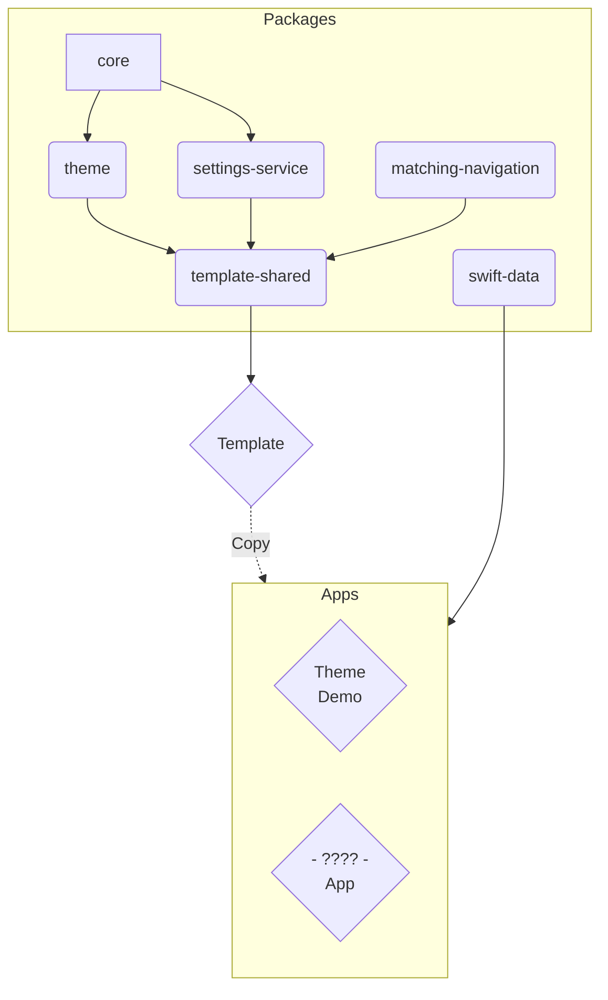

# SNAP - SN App Packages

Welcome to SNAP, a set of packages I use to build iOS Apps. They contain shared code, generic implementations of common features, and a template to kickstart a new project.

Disclaimer: Most packages are focussed on my own needs. They are public for you to get inspired, learn and tell me what I am doing wrong (srsly, pls tell me!).

## Highlights

SNAP contains a few packages in varying sizes and complexities. Some depend on each other, while others are independent. In the end they are all pieces of the [snap-app-template](https://github.com/simonnickel/snap-app-template).

The key package of the SNAP Template is [SnapTheme](https://github.com/simonnickel/snap-theme), which provides an abstraction layer to UI configuration and styling.

To explore SNAP, just check out the [example Apps](#apps) listed below.

## Guides

You need rules to break them, so I made up some of my own: [conventions](./conventions.md).

Packages are setup as described in [package-template.md](./package-template.md).

## Package Dependencies

Mermaid: [Docs](http://mermaid.js.org/intro/), [Editor](https://mermaid.live/)

## Packages

### snap-core
The [snap-core](https://github.com/simonnickel/snap-core) package contains common extensions for Swift and SwiftUI types, useful helper implementations, convenience definitions and workarounds.

### snap-theme

The [snap-theme](https://github.com/simonnickel/snap-theme) package provides a toolset to abstract Colors, Fonts, Icons and Numbers of a multi-platform SwiftUI app. Define semantic attributes in a Theme and apply them to your views for a consistent UI with maintainability in mind.

A reference and demo app is available at: [snap-app-theme-demo](https://github.com/simonnickel/snap-app-theme-demo)

### snap-settings-service

The [snap-settings-service](https://github.com/simonnickel/snap-settings-service) is a simple wrapper to handle different types of settings. It stores a `Codable` type for a `String` key, either locally (UserDefaults), synced (NSUbiquitousKeyValueStore) or in a custom store.

### snap-matching-navigation

The [snap-matching-navigation](https://github.com/simonnickel/snap-matching-navigation) package provides a SwiftUI Container that displays a TabView or SplitScene, based on the device. 

### snap-swift-data

The [snap-swift-data](https://github.com/simonnickel/snap-swift-data) package extends SwiftData to better interoperate with CoreData and Persistent History Tracking.

### snap-template-shared

The [snap-template-shared](https://github.com/simonnickel/snap-template-shared) package contains shared code to use with the snap-app-template.

## Apps

### snap-app-template

[snap-app-template](https://github.com/simonnickel/snap-app-template) is an Xcode project with a base setup of the SNAP package suite. The app comes with structure, navigation and infrastructure prepared, to quickly setup a new app using the SNAP packages.
The [snap-template-shared](https://github.com/simonnickel/snap-template-shared) package contains shared code to use with the snap-app-template.

### snap-app-theme-demo
[snap-app-theme-demo](https://github.com/simonnickel/snap-app-theme-demo) is an example app project to showcase the SNAP suite. It uses the SnapAppTemplate and showcases features of the `SnapTheme` package. It contains a reference of attributes and defaults of the `Theme` and a catalog of adjustments to explore design changes.
