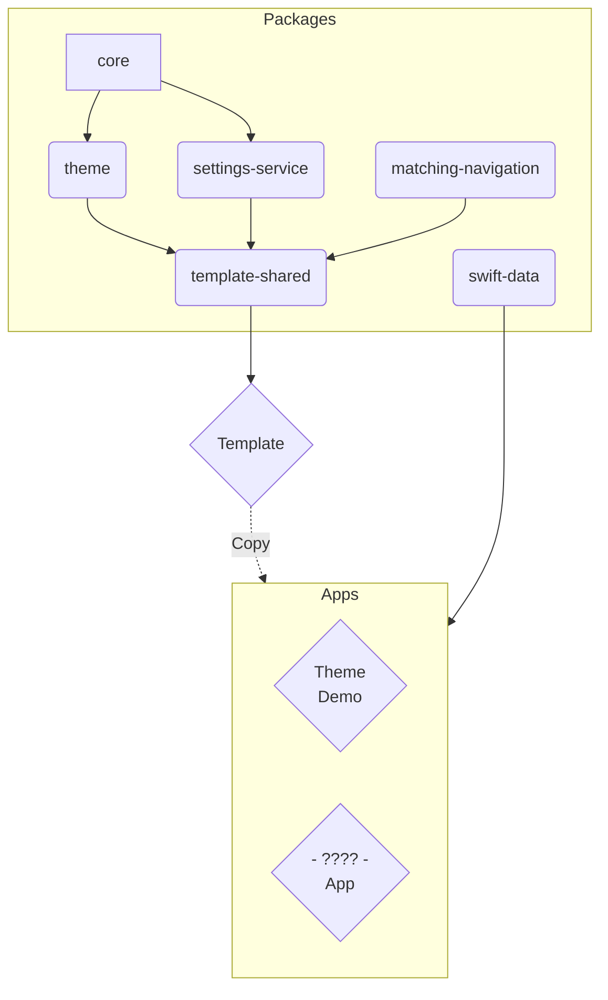

# SNAP - SN App Packages

Welcome to SNAP, a set of packages I use to build iOS Apps. They contain shared code, generic implementations of common features, and a template to kickstart a new project.

Disclaimer: Main goal of most packages is to support my own needs. They are public for you to get inspired, learn and tell me what I am doing wrong (srsly, pls tell me!). 

## Package Dependencies

Mermaid: [Docs](http://mermaid.js.org/intro/), [Editor](https://mermaid.live/)

## Packages

### snap-core
The [snap-core](https://github.com/simonnickel/snap-core) package contains some helper implementations and common extensions for Swift and SwiftUI.

### snap-theme

The [snap-theme](https://github.com/simonnickel/snap-theme) package provides a toolset to abstract Colors, Fonts and Values into semantic definitions for a SwiftUI app. It contains a Theme definition to hold semantic values and a set of ViewModifier to apply them to SwiftUI views.

### snap-settings-service

The [snap-settings-service](https://github.com/simonnickel/snap-settings-service) package contains 

### snap-matching-navigation

The [snap-matching-navigation](https://github.com/simonnickel/snap-matching-navigation) package contains 

### snap-swift-data

The [snap-swift-data](https://github.com/simonnickel/snap-swift-data) package contains 

### snap-app-template + snap-template-shared

[snap-app-template](https://github.com/simonnickel/snap-app-template) is a Xcode project with a base setup of the SNAP package suite. The app comes with a basic structure, navigation and infrastructure. It is used as a template to quickly setup a new app.
The [snap-template-shared](https://github.com/simonnickel/snap-template-shared) package contains shared code to use for the snap-app-template.
