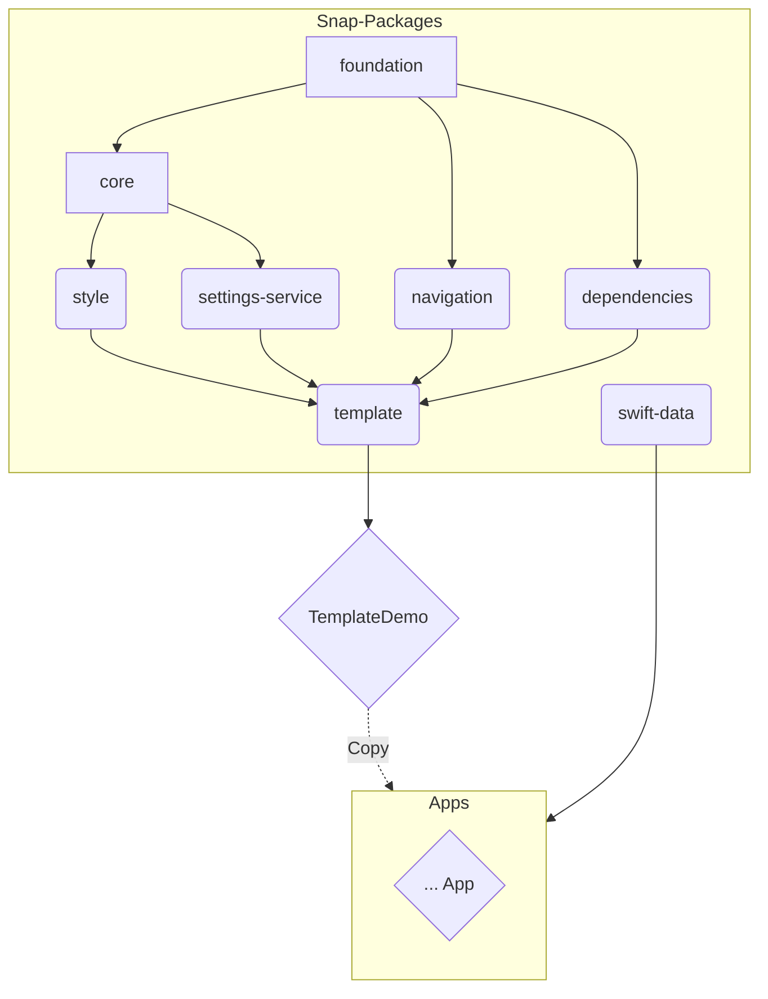

# SNAP - SN App Packages

SNAP is a set of Swift packages I use to build iOS apps. This repository is the overview for the suite; the packages live in their own repositories.

The packages contain shared code, reusable implementations of common app features, and a template for starting a new app. They are public for reference and feedback, but they are mainly shaped around my own projects.

## Highlights

SNAP contains a few packages in varying sizes and complexities. Some depend on each other, while others are independent. They are all pieces of the [snap-template](https://github.com/simonnickel/snap-template).

Another key package is [SnapStyle](https://github.com/simonnickel/snap-style), which provides an abstraction layer to UI configuration and styling.

To explore SNAP, use the Demo project in [snap-template](https://github.com/simonnickel/snap-template).

## Guides

You need rules to break them, so I made up some of my own: [conventions](./conventions.md).

Packages are set up as described in [package-template.md](./package-template.md).

## Package Dependencies

```mermaid
flowchart TD

    subgraph Snap-Packages
    C1[foundation]
    C2[core]
    M2(style)
    M3(settings-service)
    M4(navigation)
    M5(dependencies)
    M6(swift-data)
    M1(template)
    end
    
    A1{TemplateDemo}

    subgraph Apps
    A3{... App}
    end

    C1 --> C2
    C1 --> M4
    C1 --> M5

    C2 --> M2
    C2 --> M3

    M2 --> M1
    M3 --> M1
    M4 --> M1
    M5 --> M1

    M1 --> A1

    A1 -.->|Copy| Apps
    M6 --> Apps
```
Mermaid: [Docs](http://mermaid.js.org/intro/), [Editor](https://mermaid.live/)

## Packages

### snap-foundation

[snap-foundation](https://github.com/simonnickel/snap-foundation) contains basic extensions for Swift and Foundation.

### snap-core

[snap-core](https://github.com/simonnickel/snap-core) contains Swift, SwiftUI and UIKit extensions, helper implementations, convenience definitions and workarounds.

### snap-style

[snap-style](https://github.com/simonnickel/snap-style) abstracts colors, fonts, icons and numbers for multi-platform SwiftUI apps. Define semantic attributes in a theme and apply them in views.

### snap-settings-service

[snap-settings-service](https://github.com/simonnickel/snap-settings-service) stores `Codable` values for `String` keys in `UserDefaults`, `NSUbiquitousKeyValueStore`, or a custom store.

### snap-navigation

[snap-navigation](https://github.com/simonnickel/snap-navigation) defines SwiftUI navigation structure separately from presentation. It supports selectable destinations, stack pushes, modal presentation, deeplinks and multiple presentation styles.

### snap-dependencies

[snap-dependencies](https://github.com/simonnickel/snap-dependencies) provides a dependency injection container based on `Dependencies` key paths and a `@Dependency` property wrapper.

### snap-swift-data

[snap-swift-data](https://github.com/simonnickel/snap-swift-data) improves interoperability between SwiftData, CoreData objects, and Persistent History Tracking.

### snap-template

[snap-template](https://github.com/simonnickel/snap-template) contains shared code and a demo Xcode project for using SNAP in an iOS app. The demo includes prepared app structure, navigation and infrastructure.

## History

- The [snap-app-template](https://github.com/simonnickel/snap-app-template) was moved as Demo project into [snap-template](https://github.com/simonnickel/snap-template).
- [snap-matching-navigation](https://github.com/simonnickel/snap-matching-navigation) was replaced by [snap-navigation](https://github.com/simonnickel/snap-navigation).
- [snap-theme](https://github.com/simonnickel/snap-theme) was replaced by [snap-style](https://github.com/simonnickel/snap-style).

## Package Collections

Not working at the moment! The Generator does not build, will try again in the future.

`packages.json` is prepared.

[Swift Package Collection](https://www.swift.org/blog/package-collections/)
[Generator](https://github.com/swiftlang/swift-package-collection-generator)